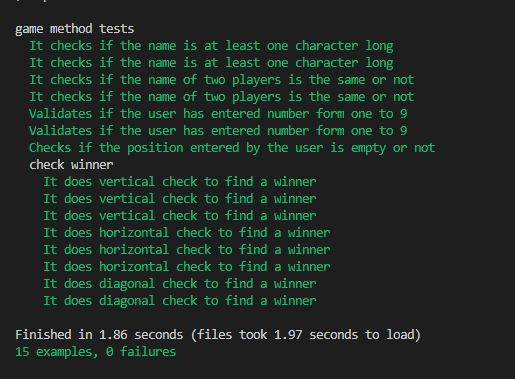

# Tic_tac_toe_game
This is a project to build a Tic tac toe game(a 3X3 board_game) using ruby and principles of OOP.

## Built With

- Ruby
- GIT
- VS CODE
- RSPEC

## Prerequisites
- Text editor
- Github profile
- Git and Ruby
- Rspec.

## How To Run The Game

- ##To get a local copy up and running follow these simple example steps.
- step1 -Open git bash in your local machine.
- step2 -git clone https://github.com/Lidya1234/Tic_tac_toe_test
- step3 -Navigate to the bin/main.rb file using cd command
- step4 -Write ./main.rb  .It will start then.
- step5 -To stop the game while it is running type CTRL+c on the keyboard

## How to play

1.Enter the name of the first player

2.The game is going to assign the player a symbol.

3.Enter the name of the second player

4.The game is going to assign the player a symbol.

5.The game is going to prompt the player to enter a choice.

6.Play the game by entering numbers from 1 to 9 only.

7.It is going to give an invalid move error message if the number is not in 1 to 9 range.

8.If the entered choice is in the range of 1 to 9 but it is already taken it is going to print an invalid position error message.

9.If a player filled consecutive row, columns, or diagonal it announces the winner

10.If it does not find a winner it is going to display Game is a draw message

## Game Instructions
Tic-tac-toe is a board game for two players, X and O, who take turns marking the spaces in a 3×3 grid. The player who succeeds in placing three of their marks in a horizontal, vertical, or diagonal row is the winner. It is a solved game with a forced draw assuming best play from both players.

  # Project Structure

        |__.rubocop.yml
        |__README.md
        |__bin
            |__main.rb
        |__lib
            |__game.rb
            |__player.rb
        |__.github
             |__linters.yml

<h2>Authors</h2>

👤 Author1

- Github: [@Lidya-github ](https://github.com/Lidya1234)
- Twitter: [@Lidya-twitter](https://twitter.com/Lidya42676629)
- Linkedin: [Lidya-linkedin-link](https://www.linkedin.com/in/lidya-ghebreigziabher-4a94391aa/)

👤 Author2

- Github: [@Adewunmi97-github ](https://github.com/Adewunmi97)
- Twitter: [@ShonibareC-twitter](https://twitter.com/ShonibareC)

## 🤝 Contributing
Show your support Give a ⭐️ if you like this project!

📝 License
This project has no license
